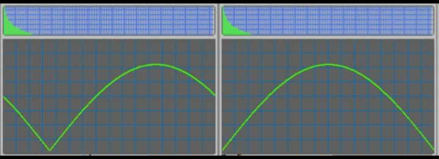
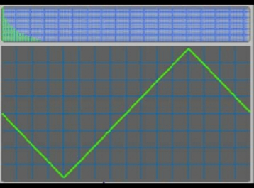
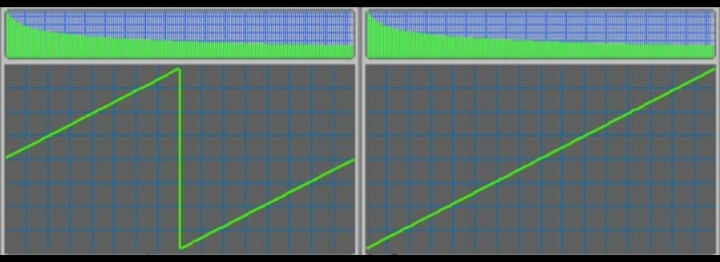
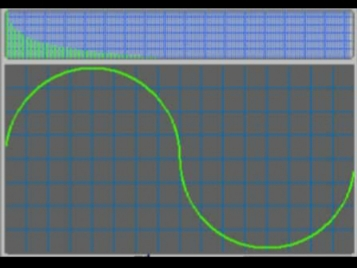

# About

This will be an article or video about waveforms that are ignored or underrated.

## Script

People say Absolute Sine is not a "basic" shape, but its harmonics say otherwise.

If we take even-numbered harmonics and keep odd-numbered ones, we get the Triangular shape.

And if instead we keep all harmonics, and extend them to infinity, we get the Sawtooth wave.

But the most forgotten wave is the Circular wave. Its harmonic distribution is weird: not as short as Triangle, not as long as Sawtooth. Just like Square and Triangle, it only has odd harmonics.

## Credits

Thanks LMMS for the graphics